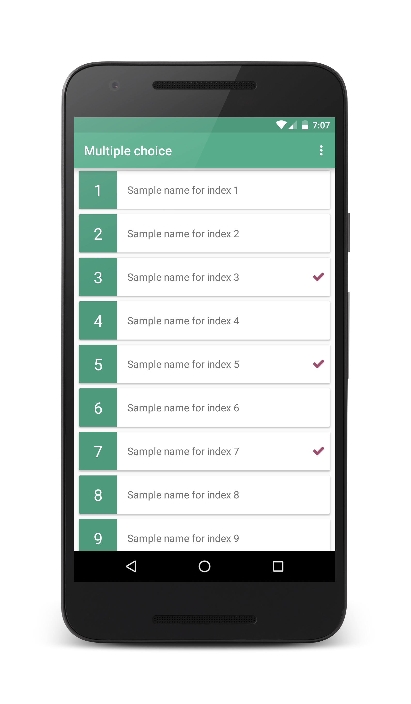
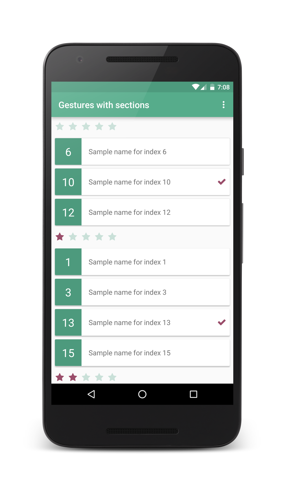

# AdvancedRecyclerView
[](https://jitpack.io/#StephenVinouze/AdvancedRecyclerView)
[](https://travis-ci.org/StephenVinouze/AdvancedRecyclerView)
[](https://android-arsenal.com/api?level=14)
[](https://android-arsenal.com/details/1/3553)
[](https://github.com/StephenVinouze/AdvancedRecyclerView/blob/master/LICENSE)

Single choice | Multiple choice | Sections
---- | ---- | ----
 |  | 

## Gradle Dependency

Add this in your root `build.gradle` file:

```gradle
allprojects {
	repositories {
		// ... other repositories
		maven { url "https://jitpack.io" }
	}
}
```
Then add the dependencies that you need in your project.

```gradle

def advancedrecyclerview_version = "{latest_version}"

dependencies {

  // ... other dependencies here
  compile "com.github.StephenVinouze.AdvancedRecyclerView:core:${advancedrecyclerview_version}"
  compile "com.github.StephenVinouze.AdvancedRecyclerView:section:${advancedrecyclerview_version}"
  compile "com.github.StephenVinouze.AdvancedRecyclerView:pagination:${advancedrecyclerview_version}"
  compile "com.github.StephenVinouze.AdvancedRecyclerView:gesture:${advancedrecyclerview_version}"
}
```

If you need to fetch the *section* module, just declare it in your dependencies without the *core* as the latter is included in the *section* module. Also *pagination* and *gesture* depend on the *section* module so same thing applies for these two modules.

## Usage

Note that this library, although written in Kotlin, will perfectly work in a Java environment. As such, the sample provided in this repository has been written in Java to prove its interoperability. The only limitation you will face while using this library in a Java environment is that you will need to use Java 8 if you need the *section* module as sections are built using **Lambdas**.

The following examples illustrating how to use this library will be written in Java to keep track of the *sample* module and illustrate how to use Kotlin **lambdas** and **extensions** in Java.

### Core

The *core* module contains the basic logic to easily manipulate a `RecyclerView`. It allows you to define your paginationAdapter in a blink of the eye, with a already built-in `ViewHolder` pattern so that you just need to define how your items will be laid out in your list.

Define your own paginationAdapter that overrides `RecyclerAdapter` and template it with the model that will be used to populate your list. Let's name it `Sample` and `SampleItemView` the `View` that will be displayed in each row of your list. Finally implement two abstract methods to specify how to display your views in your list:

```java
public class SampleAdapter extends RecyclerAdapter<Sample> {

    public SampleAdapter(Context context) {
        super(context);
    }

    @NotNull
    @Override
    protected View onCreateItemView(@NotNull ViewGroup parent, int viewType) {
        return new SampleItemView(getContext());
    }

    @Override
    protected void onBindItemView(@NonNull View itemView, int position) {
        Sample sample = getItems().get(position);
        SampleItemView sampleItemView = (SampleItemView)itemView;
        sampleItemView.bind(sample);
    }
}
```

And `Sample` our basic model:

```java
public class Sample {
    public int id;
    public int rate;
    public String name;
}
```

That's it! You can now instanciate your `SampleAdapter`, set it some `Sample` items and apply it to your `RecyclerView` by calling:

```java
SampleAdapter sampleAdapter = new SampleAdapter(getActivity());
sampleAdapter.setItems(yourSampleItems);

yourRecyclerView.setAdapter(sampleAdapter);
```

In addition, the *core* module also provides within the `RecyclerAdapter` abstract class some useful features such as **ChoiceMode** to easily configure a list with either *NONE* (default), *SINGLE* or *MULTIPLE* and retrieve all selected items in your list.

Finally, you can listen to click events and easily respond to it by setting a `clickCallback` to your `SampleAdapter`.

A full example using these features would look like:

```java
final SampleAdapter sampleAdapter = new SampleAdapter(getActivity());
sampleAdapter.setItems(yourSampleItems);
sampleAdapter.setChoiceMode(RecyclerAdapter.ChoiceMode.MULTIPLE);
sampleAdapter.setClickCallback(new ClickCallback() {
            @Override
            public void onItemClick(@NonNull View view, int position) {
                Toast.makeText(getActivity(), sampleAdapter.getSelectedItemViewCount() + " items selected)", Toast.LENGTH_SHORT).show();
            }
        });

yourRecyclerView.setAdapter(sampleAdapter);
```

### Section

The *section* module allows you to easily build sections within your list. To do so, you must override the `RecyclerSectionAdapter` abstract class. This class extends from `RecyclerAdapter` and provides two more abstract methods to shape your views that will be displayed as sections. The building itself will be automatically taken care of by a lambda that you must provide in your constructor. Let's call it `SampleSectionAdapter` and `SampleSectionItemView` our new classes to manage our sections:

```java
public class SampleSectionAdapter extends RecyclerSectionAdapter<Integer, Sample> {

    public SampleSectionAdapter(Context context) {
        super(context, (sample -> sample.getRate()));
    }

    // ... RecyclerAdapter abstract methods to implement as well

    @NonNull
    @Override
    public View onCreateSectionItemView(@NonNull ViewGroup parent, int viewType) {
        return new SampleSectionItemView(getContext());
    }

    @Override
    public void onBindSectionItemView(@NonNull View sectionView, int sectionPosition) {
        SampleSectionItemView sampleSectionItemView = (SampleSectionItemView)sectionView;
        sampleSectionItemView.bind(sectionAt(sectionPosition));
    }
}
```

Note the **Integer** generic type in the class declaration. This is require to indicate the type that will contains the section. In our case, we want to sort them by rate. This will be done via the constructor that contains a **lambda** `(sample -> sample.rate)`. That's it! Using `sampleSectionAdapter.setItems(yourSampleItems)` will do the magic for you! You may want before settings your items sorting them in any way you want (e.g. : in an ascending order).

### Pagination

You may want to enablePagination your content. The *pagination* module lets you do it without a breaking a sweat by providing an extension to the `RecyclerView` class. You just need to call the `enablePagination` method. The callback will be called every time you reach the end of your content.

To make it even smoother, the triggering depends on the amount of elements in your list to be triggered a bit before reaching the bottom so that the user does not notify the loading.

```java
PaginationKt.enablePagination(yourRecylerView, new PaginationCallback() {
            @Override
            public void fetchNextPage(int nextPage) {
                // Load your next page, refresh your content, etc.
            }
        });
```

As a limitation, the pagination events won't be triggered if your list contains sections. Also, the library is only supporting pagination for `LinearLayoutManager` as of now.

### Gesture

The *gesture* module allows you to enable swipe-to-delete and/or move gestures from your `RecyclerView`. Same as the *pagination* module, we leverage the Kotlin language to create another extension method to the `RecyclerView` class.

```java
GestureKt.enableGestures(yourRecyclerView, ItemTouchHelper.UP | ItemTouchHelper.DOWN, ItemTouchHelper.LEFT | ItemTouchHelper.RIGHT, new GestureCallback() {
            @Override
            public boolean onMove(int fromPosition, int toPosition) {
                Toast.makeText(getActivity(), "Item selected : " + sectionAdapter.getSelectedItemViews(), Toast.LENGTH_SHORT).show();
                return false;
            }

            @Override
            public void onSwiped(int position, int direction) {
                Toast.makeText(getActivity(), "Item selected : " + sectionAdapter.getSelectedItemViews(), Toast.LENGTH_SHORT).show();
            }
        });
```

Gestures depend whether your list contains sections as the library needs to do some extra computations to correctly position your items while your list is being updated. Although the gestures is fully working with sections, the re-computations lead to animation drawbacks and limit the move gesture to one item at a time. Finally, you won't be able to move items from one section into another section as it would break the section behavior of your list.

## Pull requests

I welcome and encourage all pull requests. I might not be able to respond as fast as I would want to but I endeavor to be as responsive as possible.

All PR must:

1. Be written in Kotlin
2. Maintain code style
3. Indicate whether it is a enhancement, bug fix or anything else
4. Provide a clear description of what your PR brings
5. Enjoy coding in Kotlin :)
